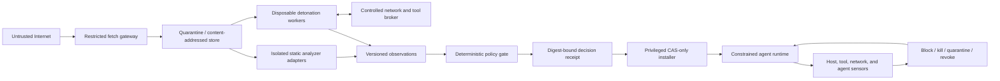

# Aragorn: architecture and roadmap

Date: 2026-07-27

Status: private implementation; qualified Phase 0 validation milestone complete; bounded Phase 1 acquisition lock complete for the public-GitHub exact-commit profile; bounded exercised-profile Phase 2 exit complete; Phase 3 runtime-prevention engineering active; universal capture completeness, general archives, private repositories, trusted runtime/host attestation, runtime conformance, installer eligibility, EDR status, and public release remain blocked

Companion evaluation: [`agent-capability-admission-evaluation.md`](../agent-capability-admission-evaluation.md)

**Aragorn** stands for **Agent Runtime Admission, Governance, Observation, Response, and Neutralization**. It is the working name of both the open-source project and its CLI.

## Executive decision

Yes, this can become an **EDR-style framework for agent skills**, but the name has to match the capability delivered:

- **Phases 0–1:** capability admission control. It resolves and pins what will be installed, collects scanner evidence, and allows only reviewed digests.
- **Phase 2:** admission control plus behavioral detonation. It exercises the artifact in isolation and compares declared behavior with observed behavior.
- **Phase 3:** runtime-prevention engineering. It adds continuous digest attribution and external block, terminate, quarantine, isolate, and revoke controls; passing its gates earns the agent-capability EDR label.

The defensible public claim is:

> For supported agent runtimes, only reviewed artifact digests receive declared capabilities; monitored violations trigger containment.

Do not claim that the system proves a repository is safe, detects every obfuscation method, or replaces a general endpoint EDR.

## What makes this worth building

The strongest version is not another scanner. Cisco, NVIDIA, Snyk, GitHub, and other projects already inspect skills, repositories, prompts, dependencies, or MCP configuration. [Cisco DefenseClaw](https://cisco-ai-defense.github.io/docs/defenseclaw) also has substantial overlap in admission, policy, drift, and runtime enforcement. [NVIDIA SkillSpector](https://github.com/NVIDIA/SkillSpector) provides strong static analysis, while [`gh skill`](https://cli.github.com/manual/gh_skill_install) provides distribution and installation mechanics.

This project should specialize in the boundary those controls do not universally guarantee:

1. Resolve a repository's installation path into the exact source, redirects, release assets, archives, dependencies, and generated downloads that can be determined without executing it.
2. Store those bytes by digest before analysis.
3. Compose existing analyzers instead of replacing them.
4. Exercise the capability in a strongly isolated environment when deep analysis is requested.
5. Install only the exact analyzed bytes—never re-fetch the URL after approval.
6. Attribute subsequent process, file, network, tool, prompt, and memory effects to that approved digest.
7. Enforce response outside the model's authority.

This is a high-powered lens on adversarial obfuscation because it does not depend only on understanding the disguise. Encoding and prompt obfuscation become less useful when the final file read, process start, credential access, or network connection is still observable. The limitation is equally important: dormant, environment-specific, remote, or sandbox-aware payloads can avoid a finite detonation. Continuous runtime enforcement is what closes part of that gap.

The best strategic position is therefore **a specialized, vendor-neutral evidence and enforcement backend that can integrate with Cisco, NVIDIA, GitHub, and agent runtimes**, not a replacement for all of them.

## Implemented Phase 0 scope

```text
Source:       local directory or evaluation-only exact public GitHub commit
Artifact:     file-based Agent Skill
Identity:     canonical tree digest plus per-file SHA-256 digests
Resolution:   bounded literal graph plus exact same-repository GitHub expansion
Analysis:     trusted administrator-installed JSONL adapters; untrusted output
Detonation:   evaluation-only isolated OCI comparator execution; no product detonation
Runtime:      not implemented
Interface:    standard-library base CLI; locked crypto dependencies for signed workers
Verdicts:     ALLOW | REVIEW | DENY | ERROR
Benchmark:    process and digest-bound OCI evidence-smoke runners; efficacy disabled
Handoff:      v2 semantic import/execute/export/sign/accept/compose; authenticated public smoke retained
Comparators:  pinned Cisco and NVIDIA local Linux/arm64 OCI images
```

Local input and the private evaluation-only public-GitHub acquisition path
establish only `source_tree` closure. The Phase 0 literal resolver produces a
separate `source_reference_graph`, not the admission `artifact_graph`, so the
current CLI cannot produce `ALLOW`. The evaluation-only expansion path can
recursively retain supported exact blobs from the same repository and commit
for comparator input, but its complete result is still not an admission
manifest. Phase 1 now provides a supported quarantine, recursive
artifact-closure, dedicated fetch-gateway, and protected transaction-record
boundary for the bounded public-GitHub exact-commit profile.

Phase 0 sanitizes adapter environment, retains raw streams, bounds output plus the lifetime of the adapter's process group, and launches a private CAS materialization of the entrypoint bytes opened during validation. It does not sandbox adapter code. Non-writable staging permissions are not an OS security boundary, and interpreters, imported packages, dynamic libraries, detached descendants, host filesystem access, and network access are not confined. Until the existing sandbox backend and complete dependency-closure identity are integrated, adapters are trusted dependencies and should run on a disposable analysis host.

The narrower OCI comparator path verifies and launches the two pinned local images through a fixed hardened profile. Each container receives only a read-only CAS-materialized fixture, no network, a read-only root filesystem, dropped capabilities, no-new-privileges, a non-root identity, and explicit resource limits. The runtime inventories the fixture immediately before creation and after execution. Evidence v3 retains the raw content-addressed OCI index/platform/provenance/config graph, verified subject digest, effective configuration, pre/post Docker context/engine/worker receipts, image/container inspection records, raw reports, normalized observations, and derived verdict. The separated label-free path prepares private dispatch state, executes one label-free job at a time, atomically publishes an exact output CAS, and wraps the independently re-verified v3 closure in evidence v4. The collector publishes the complete nonce set as one atomic local ledger batch after verification. The local Unix endpoint is pinned for every daemon command and continuity-checked, but its engine and worker identity remain self-reported rather than independently attested.

Treat these as later, separate trust boundaries:

- Remote and local MCP servers.
- npm, PyPI, OCI, Homebrew, or arbitrary package installation.
- Windows and macOS detonation and sensors.
- General repositories with no Agent Skill boundary.
- Agent-to-agent propagation and delegated capability graphs.

A Linux detonation result must never be marketed as coverage for a Windows loader. Unsupported platform behavior returns `REVIEW` or `ERROR`, not `ALLOW`.

## Security model

### Assets

Protect developer source, signing keys, SSH keys, tokens, browser sessions, cloud credentials, internal services, agent prompts and memory, tool grants, policy, approval records, telemetry, and other agents that might consume outputs from the capability.

### Minimal trusted computing base

Only these components are trusted to make or enforce security decisions:

1. Digest verifier and content-addressed store integrity path.
2. Deterministic policy decision point.
3. Installer and runtime enforcement point.
4. Out-of-process host sensor and network/tool proxy.
5. Policy, revocation, and receipt keys once decisions cross machines.

Everything else in the target design is untrusted: repositories, `README.md`, `SKILL.md`, archives, fetchers, parsers, sandboxed scanner plugins, LLM output, analyzer verdicts, sandbox guests, tool descriptions, remote MCP servers, and agent messages. They may produce typed evidence; they cannot issue an effective approval. The unsandboxed Phase 0 analyzer executables are the temporary exception documented above.

### Trust boundaries and data flow



In the target architecture, the control plane never executes artifact bytes, and acquisition, parsing, analyzers, and detonation run without production credentials or writable developer-host mounts. Phase 0 has not earned that isolation guarantee: its adapters run as the current user and must be placed on a disposable analysis host.

### Security invariants

1. No attacker-controlled code executes on the control plane or developer host before approval.
2. Detonation receives no real secrets, production credentials, privileged devices, or writable host mounts.
3. Every supported external artifact is resolved, hashed, retained, and assessed—or admission remains incomplete.
4. Runtime-generated downloads pass through the same broker; unknown bytes cannot execute.
5. LLM conclusions and scanner verdicts are observations, never authorization.
6. Enforcement lives outside prompt context and cannot be disabled by the agent.
7. A child agent can receive no more authority than its parent.
8. Approved, installed, and executed digests must match.
9. Cache identity includes the artifact, analyzer, configuration, policy, model, and environment versions.
10. Process, tool-call, download, and agent-message events retain causal lineage.
11. Quarantine and revocation do not depend on the publisher, registry, or model agreeing.
12. An agent cannot approve itself, modify policy, suppress sensor health, or overwrite evidence.

These are the reference-monitor properties that separate an enforcement system from an advisory scanner. See the [NIST definition of a reference monitor](https://csrc.nist.gov/glossary/term/reference_monitor).

## Architecture by plane

### 1. Acquisition plane

The acquisition service accepts a GitHub URL, full commit, and skill path. It performs no repository-provided setup command.

The implemented Phase 0 slice is narrower: `acquire-github` accepts only an
unauthenticated public `https://github.com/OWNER/REPOSITORY`, an exact
lowercase 40-hex commit, and a canonical relative skill path. It uses GitHub
Smart HTTP protocol v2 for commit/tree objects and REST API `2026-03-10` for
blobs. It requires SHA-1 object format, filtered shallow support, and exactly
one checksum-valid PACK v2 base object of the requested type; it independently
reproduces the raw commit/tree Git SHA-1 before walking the tree. Every blob's
Git SHA-1 is also reproduced before its bytes are stored by SHA-256, and
publication occurs only after all bounded blobs validate. It rejects
redirects, credentials, proxies, deltas, extra objects, links, submodules,
special modes, Git LFS pointers, path-normalization collisions, truncation,
deadline exhaustion, and other resource-limit exhaustion. The current handoff
retains a canonical proof sidecar plus every raw commit/tree payload. The broker
rehashes their Git and CAS identities, resolves the manifest skill path from
the proved root, rewalks the complete skill subtree, and rejects missing or
extra proof objects. This source proof alone still does not produce recursive
`artifact_graph` closure.

`resolve-artifacts` is a second evaluation-only Phase 0 surface. It reads only
re-verified CAS bytes, NFKC-normalizes bounded text for discovery while retaining
raw source offsets, resolves canonical local paths and same-repository exact
SHA-1 GitHub URLs only when their target is already in the retained root, and
records mutable, dynamic, external, encoded, normalized, opaque, LFS, and
submodule cases as incomplete. It performs no network request and launches no
source content. `source_reference_graph.status = "complete"` is scoped only to
`phase0-literal-source-refs/v1`; it does not prove that generated references are
absent and can never satisfy the policy-required `artifact_graph` scope.
For a GitHub root the graph records
`github_api_membership_asserted_blob_identity_reverified`: retained blob Git
SHA-1 identities are rederived. That historical evidence label is intentionally
unchanged; the evaluation-only graph does not consume the gateway proof and
therefore cannot claim its stronger assurance.

`expand-github` is the bounded Phase 0 differentiation candidate. It caches one
immutable session and tree cache per exact commit while sharing one credential,
monotonic deadline, and API request/byte budget across the root and recursive
acquisition. It scans the same retained-text grammar as `resolve-artifacts`,
follows only exact same-owner and same-repository blob references, including
references to another immutable commit, independently rederives Git blob SHA-1
and SHA-256 identities, and bounds retained bytes, objects, depth, and reference
occurrences. A complete result creates a
deterministic inert comparator subject. Mutable, cross-source, dynamic, opaque,
LFS, submodule, missing, or exhausted-budget cases create an incomplete
accounting receipt with null comparator identity. Neither result satisfies
`artifact_graph` closure or authorizes admission.

The Phase 0 monotonic checks bound work between HTTP operations, but the
underlying direct client's read timeout is activity-based. It is therefore a
best-effort transport deadline, not a hard wall against continuous byte
trickling; the dedicated fetch gateway owns that production guarantee.

Responsibilities:

- Resolve branches, tags, releases, redirects, submodules, and Git LFS objects to immutable identities where supported.
- Parse statically identifiable URLs and fetch-execute instructions from all files in the skill tree.
- Use a dedicated egress path with allowed schemes, private-address denial, DNS rebinding protection, IP pinning, redirect limits, byte limits, and timeouts.
- Safely inventory archives with limits on nesting depth, expansion ratio, total bytes, file count, path length, symlinks, and traversal.
- Redact URL query credentials before persisting evidence.
- Record unresolved or dynamically generated references rather than silently ignoring them.

Output: a versioned acquisition manifest and immutable blobs. If closure is incomplete or contains any unresolved reference, policy cannot issue `ALLOW`.

### 2. Content-addressed storage plane

The local MVP uses a filesystem CAS:

```text
$STATE_DIR/
└── blobs/sha256/ab/cdef...
```

Phase 0 stores source bytes, manifests, source-reference graphs, resolution
results, observations, and decisions in the same content-addressed namespace;
their schema identifies their type. Writes use fd-relative temporary files,
streaming hashes, `fsync`, and no-overwrite hard-link commits before becoming
read-only. Every read and materialization re-verifies the digest. Type indexes
and run indexes are future query-layer work, not separate sources of identity.

SQLite may index local evidence once queries require it, but it is not the source of artifact identity. Object storage, queues, worker identities, and signed cross-host receipts belong to the scale phase.

### 3. Analysis plane

Use subprocess adapters for existing tools such as [Cisco Skill Scanner](https://cisco-ai-defense.github.io/docs/skill-scanner) and [NVIDIA SkillSpector](https://github.com/NVIDIA/SkillSpector). An adapter receives a staged workspace path and emits structured observations.

Rules:

- Analyzer entrypoints are administrator allowlisted, opened and CAS-ingested once, then launched from that private materialization directly without a shell from a separate empty control directory.
- Analyzer configuration is consumed through one verified file descriptor. Executables inside the inspected repository/state and later absolute, home-relative, or parent-traversing filesystem path arguments are rejected; remaining relative arguments run from an empty control directory, and integrations use dedicated installed wrappers.
- Phase 0 bounds output and supervises the main process group. The sandbox phase adds enforceable memory, file, process, and network limits.
- Logs go to `stderr`; canonical JSON Lines goes to `stdout`.
- Malformed output, timeout, crash, version disagreement, or subject-digest mismatch produces `ERROR`.
- An analyzer receives no core API to write the CAS, install files, approve an artifact, or alter policy. Phase 0 still trusts its unsandboxed host behavior.

An LLM-based semantic challenge can be another analyzer, but its output must include model and prompt/configuration identity and is never sufficient for `ALLOW`.

### 4. Detonation plane

Do not build a hypervisor or custom sandbox. Adapt an existing hardened backend such as [OpenSSF Package Analysis](https://github.com/ossf/package-analysis), which already uses gVisor and captures file, process, and network behavior. [gVisor](https://github.com/google/gvisor) is explicit that ordinary containers alone are not a sufficient boundary for untrusted code.

The detonation profile provides:

- A disposable fake home and repository.
- Harmless canary credentials, files, environment variables, browser artifacts, and service endpoints.
- A controlled network broker with simulated or allowlisted destinations.
- Instrumentation for process trees, file access, network attempts, tool calls, prompt/memory mutations, and generated artifacts.
- Multiple scenario prompts, clocks, environment profiles, and repeated runs to expose nondeterministic behavior.
- A declared-versus-observed capability diff.

Detonation is evidence, not proof. A quiet run can still receive `REVIEW`, and a sandbox escape is a release-blocking critical vulnerability.

P2.1 implements only the deterministic category-level declared-versus-observed
diff for the six roadmap action kinds. It does not attest that an action was
observed, select a backend, execute artifact bytes, or grant admission authority.

P2.2 accepts one strict bounded source-event grammar, derives its capability,
and binds both in CAS to exact subject, input manifest/tree, run request, and
normalizer identities. Verification reopens the source event and independently
re-derives the category. This is not proof of real or isolated execution.

P2.3 retains and replays the pinned gVisor binary identities, its exact
collector/helper source closure, Docker daemon registration, inert Linux/arm64
image, exact container controls, pre/live/post inspection, and the live
runtime-process graph for one run. The collector binds the Docker
endpoint and normalized daemon self-report before and after execution and binds
the sandbox and gofer `/proc` executable identities to the held-open `runsc`
inode. These remain operator-captured self-reports, not runtime, worker, VM, or
host attestation. P2.3 does not establish isolation, detonation, egress
mediation, backend qualification, admission authority, or a Phase 2 exit.

P2.4 retains a canonical caller-selected observation/source binding set and
independently replays every P2.2 observation into the exact P2.1 capability
diff. Its closure contains the receipt, diff, observations, and raw canonical
source events. It proves integrity only relative to the caller-held selected
set; it does not prove that a backend executed or that capture was complete.
The fixed-canary collector adds a new run-local composition path: when invoked,
it binds one pinned container's pre/live/post state, gVisor process graph,
cleanup, and bounded JSON `openat`/`execve` trace to the normalized observations
and capability diff under one run identifier. It neither imports historical
P2.3 execution as same-run evidence nor executes arbitrary acquired artifacts.
A second fixed-profile path live-verifies one ordinary Phase 1 public-GitHub
quarantine receipt, copies its complete source closure into a separate CAS,
materializes only the implementation-pinned inert entrypoint, and mounts that
exact file read-only for the same gVisor evidence path. Portable replay verifies
the recorded acquisition bytes without promoting cross-host filesystem custody.
The fixed systemd profile now also fails closed unless its trace directory is a
root-owned hardened tmpfs capped at 8 MiB and 32 inodes with five-file headroom,
the collector shares PID 1's mount namespace, and the live container shim shares
that namespace. The packaged mount is ordered before and required by Docker and
containerd, and current-container trace files are removed after container cleanup.
The receipt does not retain mount tables, attest every short-lived runtime writer,
or generalize to other service layouts or daemon namespaces.
The versioned `successful-openat-execve-set/v1` path keeps the same fixed lock
and artifact but binds the selected profile in both its run request and v2
receipt. It strictly parses successful boot-log pairs, requires the existing
`sha256sum` execution/read anchors, and emits a sorted set deduplicated by
operation and path. The retained run contains four read opens, one write open,
and two executions; nine failed calls remain available only in raw JSONL.
This profile observes two syscall classes from one bounded boot log. It does
not prove bytes were written, preserve process or temporal multiplicity,
establish causal ancestry, or provide capture completeness.
The v3 `bounded-single-script/v1` profile replaces the fixed source identity
with caller-held pins for one canonical public source tree, shell entrypoint,
entrypoint digest, execution and normalization profiles, and declared
capabilities. The retained run replays all 69 source, implementation, request,
raw-trace, observation, diff, and receipt blobs from a fresh CAS. Its matched
`file-read` and `process-exec` categories coexist with undeclared `file-write`
to `/dev/null` in the bounded execution path; `RECORDED` is evidence, not a
clean capability verdict. This profile does not establish script safety.
`RECORDED` grants no capture completeness, backend qualification, runtime
attestation, isolation, admission authority, or Phase 2 exit.
The v4 `successful-openat-execve-attributed/v1` contract retains an ordered
manifest around the exact script-entry boundary. It classifies pre-boundary
events as harness, the wrapper launch as entrypoint, same-thread events after
the launch completes as subject, and unrelated post-boundary events as unknown;
only subject events enter the capability diff.
Portable replay re-derives that manifest and verifies its CAS binding. The
retained v3 matrix exercises it in all 100 cells and fails closed on `unknown`;
this bounded epoch classifier still does not prove process ancestry or universal
capture completeness. The lockless metrics checkpoint keeps
the original caller-declared, unfrozen v1 contract. Its opt-in v2 path requires a
caller-held digest for a canonical pre-outcome lock over the exact candidate,
held-out coverage, separate local-suite and acquired-source manifest identities,
bounded entrypoint and declared-capability pins, and gVisor v4 verifier inputs.
Only the locked Aragorn cells enter the dedicated v4 verifier; it rejects unknown
attribution scopes and re-derives each verdict from the verified capability diff.
Both checkpoint versions always report `phase2_exit_eligible: false` by design:
they are metrics-only. A separate Phase 2 exit gate must independently
re-evaluate the locked report and compose exact-profile backend qualification
with configured-point remote-capture completeness. Only a tracked, validated
exit-gate report can establish bounded Phase 2 completion; that does not earn
the EDR label or public-release readiness. Phase 3 is runtime-prevention
engineering.
The retained
[`phase2-exit-gate` report](./benchmark/receipts/phase2-exit-gate-1c47d2fc62332152dfad337a4288e53c-2026-08-03.json)
and replayable
[evidence archive](./benchmark/evidence/phase2-exit-gate-1c47d2fc62332152dfad337a4288e53c-2026-08-03.tar.gz)
compose those leaves and pass the bounded exercised arm64 profile. They do not
establish trusted Sentry, runtime, host, or hardware attestation; universal
event completeness; independent efficacy; Phase 3 response; or release
authority.
The Phase 2 matrix preparer now sends the exact 20-case public catalog through
the ordinary protected GitHub gateway, materializes a separate local suite,
freezes the source/suite/candidate/gVisor lock, and atomically publishes one
relative-path operator index. The runner treats that index only as path hints,
revalidates the caller-held lock and every source CAS, executes the collector
serially under its host-global lock, and atomically publishes one `results/`
directory containing 100 outcomes plus the locked checkpoint report. Unknown
v4 attribution stops collection immediately. The pinned fixtures deliberately
stay on the existing same-thread classifier; they do not claim descendant
process attribution, independent authorship, varied environment coverage, or
efficacy.

### 5. Decision plane

Policy evaluation is a pure deterministic function over typed evidence:

```go
func Evaluate(
    policy PolicyV1,
    manifest AcquisitionManifestV1,
    results []AnalyzerResultV1,
) DecisionV1
```

The evaluation precedence is:

```text
ERROR > DENY > REVIEW > ALLOW
```

`ALLOW` requires complete supported acquisition closure, all required analyzers succeeding, no hard-deny condition, and the requested capability set fitting policy. Inputs and reason codes are sorted so identical bytes, analyzer versions, target profile, and policy produce identical output.

Policy may use facts such as an undeclared network destination, an executable artifact, a signature identity, scanner disagreement, or a canary read. It must not depend on free-form model prose, repository popularity, or a single aggregate trust score.

The framework therefore has probabilistic evidence producers and deterministic authority. LLM, heuristic, anomaly, and detonation components may emit versioned observations; only the deterministic policy and external enforcement planes can authorize or cause an effect.

### 6. Installation and enforcement plane

The privileged installer does very little:

1. Load a current `ALLOW` receipt from a protected location.
2. Verify policy identity, target runtime, expiry, and revocation state.
3. Re-hash the complete manifest and every blob.
4. Materialize only CAS bytes into a protected staging directory.
5. Re-hash the staged tree.
6. Atomically activate it in the one supported runtime.
7. Record the active artifact-set digest and runtime identifier.

If the selected runtime cannot prevent direct writes to the active skill directory, cannot consume verified staged bytes, or offers only a removable prompt/MCP hook, it is not yet a valid enforcement integration.

Runtime selection is conformance-based, not brand-based:

| Profile | Mandatory properties |
|---|---|
| Admission-conformant | `DET-01` identical canonical manifest, evidence, policy, and target-runtime inputs produce identical decisions; `ADM-01` exact admitted bytes are activated; `ADM-02` every runtime-declared activation path, including install, update, direct write, rename or symlink, auto-discovery, reload, and restart, must gate or deny; `ADM-03` policy failure or tampering fails closed |
| Runtime-prevention-conformant | Admission properties plus `RUN-01` every protected-action attempt has digest and causal attribution and unattributed attempts block; `RUN-02` pre-effect blocking, revocation, and sensor-health enforcement |
| A2A-conformant | Runtime prevention plus `A2A-01` child authority is the intersection of parent and explicitly delegated authority; defer until single-capability attribution works |

OpenClaw, Hermes, Pi, or another runtime earns a role only by passing the applicable mandatory properties. A failed mandatory property cannot be averaged away by scanner accuracy.

Each property result is `PASS`, `FAIL`, or `NOT_TESTED`; `NOT_TESTED` never satisfies a profile. No runtime currently has a passing conformance result. The retained OpenClaw `2026.7.1` probe passed explicit install blocking but failed `ADM-02/direct-write`: OpenClaw discovered a directly written, model-visible skill without invoking `security.installPolicy`. That mandatory failure eliminates this version as a standalone admission reference monitor; its hook remains usable only as defense in depth. A separate OS-mediated contained profile passed install, direct-write, rename, symlink, auto-discovery, runtime restart, policy-failure, unprivileged policy-tampering, formal `ADM-01` exact conformance-fixture activation, three of nine inventoried update routes, six of twelve reload routes, and the retained activation and recovery slices. `ADM-02/update/workshop-proposal-apply` failed because the configured install policy blocked the positive-control installer but was not invoked when workshop apply created the workspace skill. The cumulative route ledger therefore records 3/9 update `PASS`, 1/9 update `FAIL`, and 6/12 reload `PASS`; the formal profile is `FAIL` and installer-ineligible. The remaining routes, including `reload/workshop-invalidation`, stay `NOT_TESTED`. This is a bounded result for the pinned runtime, configuration, route, and retained evidence, not a general OpenClaw security claim. A DET-only receipt separately passes four fixed decision exits across three clean processes each but is not composed with the runtime receipt; host, daemon, and root tampering are outside the retained claim. A fake runtime validates only Aragorn's harness, not mediation, privilege separation, hook timing, tamper resistance, or attribution in a real runtime.

The separate protected-route raw-action receipt binds a hardened read-only-root
profile to five `OBSERVED` actions and seven `NOT_TESTED` routes. It records no
conformance verdict, grants no installer authority, and does not alter the
cumulative route ledger.

An additive exact-profile verifier now qualifies only the protected native
workshop apply as route-level `PASS`. It binds the retained source closure,
all protected discovery mounts, unprivileged gateway identity, successful
proposal creation, `EROFS` apply denial, and unchanged absent/discovery state.
It does not reinterpret the earlier writable-profile `FAIL`, promote aggregate
`ADM-02`, or grant installer, Phase 3, EDR, or release authority.

A second additive exact-profile verifier qualifies only
`ADM-02/update/archive-source-force-replacement` as route-level `PASS` for
existing-target pre-effect denial. It binds the full pinned runtime tree before
and after, a successful writable-target positive control using the same valid
inert directory source, the protected attempt's `EROFS` staging denial, and
unchanged existing-target and discovery state. Uploaded archives were disabled
before ingest, so no archive bytes were ingested and the result does not
qualify archive parsing. Aggregate `ADM-02`, admission-profile and installer
eligibility, `RUN-01`, `RUN-02`, Phase 3, EDR, and release authority remain
false.

The retention pre-gate re-verifies every referenced conformance-evidence blob
from the protected CAS. This proves blob identity and availability, not the
truth of individual scenario claims. Positive `PASS` remains
installer-ineligible until a semantic evidence verifier binds every scenario
claim to the runtime and environment bindings.
The fixed OpenClaw restart pair now has an exact `ADM-02/restart` evidence
verifier; carried scenario claims remain retention-only. It rejects claim
promotion and aggregate `PASS`, grants no installer authority, and is not the
future general positive-evidence verifier.
The separate update-slice verifier binds the exact policy payload, exit code,
user-writable managed-root identity, before/after byte equality, and contained
execution profile. That route-level `PASS` does not promote formal
`ADM-02/update` or override its later cumulative `FAIL`.
The shared-filesystem update verifier separately binds one root-owned broker
transition to the same live read-only OpenClaw mount, unchanged PID/start time,
changed exact skill digest, and new immutable path. It proves the missing
broker-to-runtime composition slice only; it does not satisfy an inventoried
update/reload route or grant installer authority.
The live-reload verifiers additionally bind one admitted forced replacement to
a new watcher snapshot consumed by the same chat session and to two forced
isolated cron runs that built fresh prompt snapshots on opposite sides of that
replacement, without a gateway restart. The cron runs used distinct isolated
sessions and lifecycle revisions but stopped at model resolution before
provider execution; this proves prompt-snapshot construction, not successful
provider completion. Formal `ADM-02/update` is `FAIL`; formal
`ADM-02/reload` remains `NOT_TESTED`. These route-level observations cannot
grant installer authority.
The config-activation-slice verifier separately binds a `skills.update`
disable/re-enable transition to an earlier exact-admitted-bytes proof and the
same read-only managed-skill volume. It observes the same session dropping and
restoring the skill prompt without restart or install-policy records. It also
binds one deletion and same-session rebuild of the referenced prompt blob to the
same prompt digest and snapshot version. These are reactivation and cache
recovery of admitted bytes, not acquisition or authentication, and do not
promote either formal scenario; cumulative update is `FAIL`, while reload
remains `NOT_TESTED`.
The model-activation verifier binds the exact 104-byte fixture, prior contained
admission evidence, immutable OpenClaw runtime tree, and isolated environment
to one successful real-gateway turn. The first loopback-provider request
contained exactly one admitted skill contract and issued one `read` call; the
second carried the full `SKILL.md` bytes and completed with a fixed inert
response. Before/after target identity, the read-only mount, and gateway
process identity remained unchanged. This is sufficient for formal
`ADM-01/PASS` for the conformance fixture only. The evaluator-controlled local
provider does not prove production `ALLOW` lineage, external-model efficacy,
`DET-01`, or installer authority.

The deterministic-authority verifier independently reconstructs canonical
decisions for fixed `ALLOW`, `REVIEW`, `DENY`, and `ERROR` vectors. Each exact
manifest, evidence, policy, and target-runtime input produced byte-identical
output in three fresh CPython processes with distinct hash seeds. Its separate
receipt marks only `DET-01/PASS`; fixed analyzer inputs are not re-attested,
`ADM-01` is not composed, and installer authority remains disabled.

The first private bake-off target is OpenClaw because it exposes the clearest operator-owned pre-install policy boundary; Pi is the comparison target because its tool-call hook documents blocking on hook errors; Hermes remains a useful contained workload/detonation candidate but its hook failure behavior is not suitable for fail-closed authority. This ordering is not a runtime selection. A candidate is eliminated as soon as one mandatory scenario fails; a candidate can be chosen only after `DET-01`, `ADM-01`, `ADM-02`, and `ADM-03` all pass against an immutable runtime version. Runtime prevention additionally requires `RUN-01` and `RUN-02` with an external OS-level broker/sensor. The next production decision is to mediate and protect workspace skill writes externally or evaluate another harness.

The first external-mediation primitive now verifies and freezes a retained
staged tree, rejects occupied activation names, and publishes a fresh sibling
atomically beneath one protected root descriptor. It assumes a dedicated
broker UID is the sole writer on a local filesystem and remains private and
unwired. Current deterministic decisions, conformance receipts, and benchmark
signatures grant it no authority. The next installer unit must recompute
`ALLOW` from protected retained evidence, bind the expected runtime and
destination, and only then call the publisher in the same broker transaction.
The internal retained-input pre-gate now binds policy evaluation to re-hashed
source and opaque evidence bytes, but does not yet replay their semantics or
grant that authority.

The analyzer runner now retains a separate
`aragorn/analyzer-run-receipt/v1` for each execution. Its verifier reloads the
exact request, executable, stdout, stderr, and canonical observation blobs,
re-parses successful JSONL output, and rejects configuration, verifier,
subject, or evidence mismatch. The receipt is explicitly evidence-only:
authenticity still depends on a future broker-owned CAS and same-process
execution, so it cannot authorize the publisher.
`aragorn/decision/v2` requires each run-receipt digest but remains an evidence
summary. Its verifier reloads the retained policy and manifest, replays every
run receipt, reconstructs the complete decision, and rejects any summary or
verdict drift. Current inspection still has only `source_tree` closure, so
faithful replay returns `ERROR`. The parallel evidence-only
`aragorn/decision/v3` retains and replays an admission artifact graph bound to
caller-held expected identities, including the exact analyzer-run receipts,
and evaluates only its verified closure. The internal protected request-v4
broker now composes that replay with recursive source and pin-set identities,
runtime, destination, expiry, revocation, and protected publication. It remains absent
from the CLI and evidence-only rather than installer authority.

The source-screen-only Git identities and commit-pinned evidence anchors are
frozen in `benchmark/admission-runtime-candidates-v1.lock.json`; that immutable
screen does not absorb later runtime results. The separate bound OpenClaw
receipt is `FAIL` and installer-ineligible. Pi remains dynamically `NOT_TESTED`.

Harness selection is staged rather than skipped:

| Gate | Timing | Selection earned |
|---|---|---|
| Documentation screen | Phase 0 | Candidate list only; no adapter or winner |
| Admission bake-off | After Phase 0, before Phase 1 installer work | One exact runtime version that can activate only admitted bytes and fail closed on every discovery path |
| Detonation bake-off | Near the end of Phase 1, before Phase 2 | One contained workload harness; it need not qualify for enforcement |
| Runtime-prevention bake-off | After Phase 2, before Phase 3 | One exact runtime version with causal attribution and external pre-effect response |

A candidate may qualify for detonation and fail admission or prevention. Every
result is bound to the runtime commit or image, adapter, configuration, worker,
OS profile, policy, and Aragorn version; upgrades require requalification. The
isolated label-blind comparator worker is one Phase 0 assurance prerequisite and does not
depend on selecting OpenClaw, Pi, Hermes, or any other production runtime.

### 7. Runtime detection and response plane

This is the plane that earns the EDR label.

Reuse established host telemetry—such as [Falco's plugin model](https://falco.org/docs/concepts/plugins/architecture/) or [Tetragon](https://tetragon.io/docs/concepts/)—rather than creating a new eBPF sensor. Add an agent-host hook for semantic events that the operating system cannot attribute by itself.

Required event classes:

- Skill activation and completion.
- Tool-call attempt and result.
- Process execution and ancestry.
- File read, write, rename, and executable creation.
- Network connection and DNS attempt.
- Credential/canary access.
- Prompt, context, or memory mutation where the runtime exposes it.
- Child-agent creation, delegated capability, and message lineage in a later A2A phase.

Required responses:

- Alert and retain evidence.
- Block a pre-effect tool or network action.
- Terminate the capability process tree.
- Quarantine the installed digest.
- Revoke future starts of the digest.
- Isolate egress or suspend high-risk operations when sensor health is lost.

Post-effect audit events can support detection and forensics but cannot honestly be described as prevention. A blocking claim requires a synchronous pre-effect hook or a lower-level enforcement point that stops access before the protected sink.

The first retained P3.0 harness slice exercises that boundary narrowly. A
deterministic loopback provider causes one exact fixture skill to be read and
then issues one `write` call in the same run and session. An externally
read-only mount rejects the call with `EACCES`, and the protected directory is
unchanged. The canonical evidence binds the skill, configuration, probe,
runtime entrypoint, provider requests, runtime history, process identity, and
mount snapshots. Because the provider is evaluator-controlled and the guard is
a static mount rather than an Aragorn policy broker, the slice grants no
`RUN-01`, `RUN-02`, Phase 3, EDR, or release authority. The next increment must
replace the static guard with a digest-bound policy request and independently
health-checked mediator before any runtime-prevention property can pass.

P3.1 implements only the deterministic half of that increment. One pure
decision binds the complete request to separately supplied active attribution
and action measurement, an exact runtime-scoped allow rule, current revoked
skill set, and a short-lived health statement from the sensor identity pinned
by policy. Caller-supplied trusted floors reject revocation-generation and
health-epoch rollback. Unknown, stale, mismatched, revoked, unmeasured, or
unattributed actions block. Invalid trusted policy, attribution, measurement,
revocation, or health state aborts evaluation and must be handled as no-effect.
The decision binds every supplied authority input but explicitly disclaims
effect and RUN conformance authority.

P3.2a composes this core with one private create-only broker primitive. It uses
a canonical 4-byte-length-prefixed Unix stream with an exact EOF, Linux
`SO_PEERCRED`, distinct broker/runtime UIDs, a broker-only deadline-bound lock,
descriptor-relative protected reads and state replacement, independent
monotonic revocation and health qualification, five-second replay retention,
and final state/time re-evaluation after the replay claim. The broker derives
the operation, protected-root inode plus target, and payload digests from raw
bounded effect arguments. An exact final `ALLOW` hard-links a broker-private
same-filesystem staged inode into an absent host-only target and never replaces
an existing entry. Every trusted control writer must use the same lock-sharing
publication primitive. That primitive publishes counters before their durable
floors, rejects counter rollback and same-counter equivocation, and requires a
strictly increasing observation sequence. Runtime policy is provisioned before
startup and immutable for the broker lifetime. A separate broker-owned
mode-`0600` instance lock serializes broker lifetimes and permits safe removal
of an identity-checked stale socket after a crash; upgrades from a pre-lock
broker require an explicitly serialized stop. Errors after the link are
indeterminate, not evidence of a block. Process-exit signals still propagate;
P3.2c adds the durable reconciliation described below.

P3.2b adds the private native OpenClaw optional-tool client and Linux service
packaging without widening the wire contract. The pinned host validates model
arguments before the tool-owned preparation step injects its run, session,
session-key digest, and provider-opaque tool-call ID digest. The tool-owned
finalize step restores that correlation after global pre-tool parameter
rewriting while preserving the rewritten public effect. The tool rejects
missing or changed host correlation, revalidates the exact public effect after
any rewrite, derives the request action digests, and performs one bounded
Unix-stream exchange with no fallback. Transport uncertainty after submission
remains `INDETERMINATE`. The service uses distinct fixed sysusers,
durable broker-owned control/protected/staging roots, Linux peer credentials,
and an AF_UNIX-only systemd boundary. The active-skill digest remains a fixed
deployment binding rather than general causal attribution. These additions are
unit/static exercised, not a live P3.2 composition.

P3.2c adds one top-level journal slot to private broker-state schema v2. Under
the existing action lock the broker durably records replay and floors, fsyncs a
validated staged inode, re-evaluates authorization, records `PENDING`, performs
one no-replace link, fsyncs and verifies the protected target, records
`APPLIED`, removes and fsyncs staging, reopens the exact target, and only then
clears the journal and responds. Startup recovers before socket creation, and
each mediation recovers before evaluation or replay pruning. Recovery never
links, reauthorizes, releases a replay claim, or retries an effect: it either
cancels an exact unlinked stage, finishes metadata cleanup for an already linked
exact inode, or fails closed on contradiction. Forked `os._exit` tests exercise
the durable process-crash boundaries; they are not forced-reset, filesystem,
or power-loss qualification. A locked private v1-to-v2 migration preserves
validated replay entries and monotonic floors, initializes the journal to
`null`, and does not infer legacy effect completion.

P3.3a adds a mandatory out-of-process observation gateway for that one
create-only route. OpenClaw sends the unchanged canonical effect envelope to a
frontend owned by the distinct `aragorn-sensor` principal. The gateway
authenticates the dedicated runtime UID and GID with Linux `SO_PEERCRED`,
recomputes operation, protected-root path, and payload digests from the raw
effect, binds the configured runtime, active-skill, and sensor digests, and
forwards one measured wrapper without retry. The backend socket admits only the
sensor principal. Under the existing action lock, the broker recovers any
durable effect journal, recomputes the envelope, request, operation, path, and
payload digests, validates the deployment pins, stamps the next health epoch,
observation sequence, and trusted lifetime, preserves any independently
published unhealthy status, publishes both control documents, and then enters
the existing replay, final-decision, and
`PENDING`/`APPLIED` effect path. There is no publish-then-forward gap in which a
different observation can authorize the request.

The systemd profile gives the sensor read-only access to the protected-root
identity, no write access to control/protected state, and no access to staging.
The runtime cannot connect directly to the sensor-group backend socket. This
proves only that a separate pinned OS principal observed and remeasured the
exact bounded create candidate received from the runtime before effect. The
session, run, and tool-call values remain opaque host correlations, and the
active-skill digest remains a deployment pin rather than causal skill
attribution. P3.3a was unit/static exercised only.

P3.3b qualifies the same synthetic create profile in a Linux container running
systemd as PID 1. The production installer provisions fixed principals and
paths with sysusers/tmpfiles; the installed units consume systemd credentials,
run without effective capabilities under `NoNewPrivileges`, receive distinct
mount and network namespaces, and expose group-scoped Unix sockets. The
retained capture records collector-observed source/installed digest and size
equality, loaded unit and credential properties, mount tables, process start
identities, filesystem metadata, and paired successful `strace` observations
of the actual `SO_PEERCRED` tuples. It exercises runtime DAC
denial on the backend, broker and sensor rejection of wrong-but-DAC-capable
principals, one mediated `ALLOW`/`CREATED` effect, unhealthy-mediator
`BLOCK`/no-effect, and stopped-sensor connection failure/no-effect. A pinned
semantic verifier replays the policy result and validates the internal
consistency of the retained control-state and effect transitions. A checked-in
capture recipe retains normalized image and HostConfig identity and runs the
container without networking.

That evidence is bounded by the exact arm64 container profile. Its privileged
outer Docker control plane is not attested, Debian package retrieval is not a
reproducible supply-chain proof, the client is synthetic rather than the pinned
OpenClaw runtime, and opaque host correlations remain non-causal. Direct-write
and other tool/process/file/network coverage, forced-reset storage
qualification, runtime admission conformance, `RUN-01`, `RUN-02`, Phase 3,
EDR, and release authority remain incomplete.

P3.3c composes the pinned OpenClaw 2026.7.1 runtime with one optional native
create tool whose only effect route is OpenClaw -> mandatory sensor -> broker
-> one create. One retained capture records the mediated `ALLOW`/`CREATED`
case, unhealthy `BLOCK`/`NOT_PERFORMED`, sensor-unavailable
`CLIENT_ERROR`/`NOT_SUBMITTED`, and the peer, DAC, and direct-write denials.
The plugin serializes each broker result as canonical structured text because
OpenClaw drops plugin `details` from retained tool history. OpenClaw's
presentation-level `isError` flag is not policy, decision, or effect authority.
The final semantic verifier module,
[`aragorn.runtime_action_openclaw_evidence`](./src/aragorn/runtime_action_openclaw_evidence.py),
independently replays the
[retained P3.3c artifact](./benchmark/evidence/runtime-action-openclaw-systemd-composition-p3-3c-2026-08-04.json)
and rejects repinned boundary mutations. This profile establishes neither
causal skill attribution nor broader action coverage, and `RUN-01`, `RUN-02`,
Phase 3 exit, EDR, and release remain false or incomplete.

P3.3d retains a versioned live-revocation capture for the same OpenClaw create
route. A single healthy control publication adds the pinned active deployment
digest between distinct allowed and revoked requests. The revoked request is
bound to that exact publication digest and generation and returns only
`ACTIVE_SKILL_REVOKED` / `BLOCK` / `NOT_PERFORMED`; protected-target and
staging snapshots remain unchanged, and broker/sensor process, socket, and
`SO_PEERCRED` identities remain stable. The child image runs by captured ID and
retains the exact P3.3c parent-layer prefix. The semantic verifier is
[`aragorn.runtime_action_openclaw_revocation_evidence`](./src/aragorn/runtime_action_openclaw_revocation_evidence.py).
Because publication is evaluator-operated and attribution remains a deployment
pin rather than causally derived runtime identity, this does not promote
`RUN-02`, Phase 3, EDR, or release authority.

P3.4a replaces the caller-declared active-skill deployment pin on one synthetic
create path with a root-provisioned process profile. After authenticating the
Unix socket peer, the sensor pins its PID and derives the exact single-process
cgroup, UID/GID and empty capability sets, start time, mount namespace,
root-owned executable digest, and one immutable root-owned `SKILL.md` through
the peer filesystem view. The sensor adopts the runtime filesystem UID/GID
with three transient bootstrap capabilities, irreversibly clears every
capability set and bounding entry before `accept()`, and retains no broker,
control, staging, or protected write authority. The broker validates the v2
attribution before entering the source-frozen v1 mediation path, fsyncs a
profile-pending record before mediation, fsyncs a result-bound profile receipt
before removing it, and refuses startup or another request while an unresolved
pending record exists. The receipt is latest-only for this single-action slice;
the paired process snapshots are not continuous exec or per-message writer
attestation.

The retained P3.4a systemd capture pins the exact P3.3b base image, proves
source-to-installed byte equality, and records one `ALLOW` / `CREATED` receipt
plus a wrong-cgroup pre-broker rejection with unchanged control and effect
state. Its semantic verifier rejects boundary and claim mutations. The client
and skill are synthetic and root-provisioned; no OpenClaw skill consumption or
semantic causation is established. Broader action/event coverage, `RUN-01`,
`RUN-02`, Phase 3, EDR, and release authority remain incomplete.

### 8. Evidence and interoperability plane

Use a canonical local JSON contract. Export findings as [SARIF 2.1](https://www.oasis-open.org/standard/sarifv2-1-os/) and runtime telemetry using [OpenTelemetry semantic conventions](https://opentelemetry.io/docs/specs/semconv/general/) where fields align. Use [in-toto attestations with Sigstore](https://docs.sigstore.dev/cosign/verifying/attestation/) only when receipts must cross a trust boundary.

The target runtime telemetry design does not retain raw prompts, tokens, credentials, or tool arguments by default. Phase 0 inventory intentionally retains inspected source bytes, and inspect/evidence-smoke runs retain bounded raw analyzer stdout and stderr because reproduction requires them; adapters must not echo production secrets, and these modes belong on a disposable host with synthetic inputs. Any cloud upload remains explicit opt-in.

## State machines

Keep artifact admission and runtime health separate.

```text
Artifact:

DISCOVERED
  -> QUARANTINED
  -> RESOLVED | RESOLUTION_INCOMPLETE
  -> ANALYZED
  -> APPROVED | REVIEW | DENIED | ERROR

Runtime:

REQUESTED
  -> DIGEST_VERIFIED
  -> STARTING_CONFINED
  -> ACTIVE_MONITORED
  -> STOPPED | QUARANTINED | REVOKED
```

Rules:

- Approval belongs to a digest, manifest, target environment, analyzer set, and policy—not a repository name, branch, tag, or URL.
- Any changed byte, redirect, dependency, tool schema, target profile, analyzer configuration, or policy creates a new assessment.
- `ERROR` and incomplete required closure never become `APPROVED`.
- A missing sensor heartbeat suspends protected operations and moves high-risk execution toward quarantine.
- Revocation blocks future starts and terminates or isolates active instances within a published response deadline.

## Implemented stable data contracts

The checked-in files under `schema/` are authoritative for document shape.
Canonical acceptance additionally requires the reference validator's bounded
decoding, Unicode normalization, ordering, collision, digest, and cross-record
rules; another implementation must pass the same negative test vectors before
it is trusted. Start contracts at version 1 and keep evidence separate from
decisions. Phase 1 now has evidence-only `artifact_graph` contracts for
self-contained local Markdown, proof-bound recursive GitHub expansion, and v4
retained release assets. V4 replay requires caller-held release-result digests
and rederives candidates from retained source bytes. V5 adds bounded
ZIP/WHL/PYZ inventory and a separate analysis manifest. V6 additionally retains
an exact GitHub-digest-backed v2 inventory archive as its raw CAS blob at a
deterministic reserved runtime-candidate path. Verified extracted members enter
only the analysis manifest. The v6 edge remains unresolved with
`GITHUB_RELEASE_ASSET_RUNTIME_CONSUMER_UNPROVEN` because no pinned resolver or
rewriter proves that the target runtime consumes that candidate path. The
broker rederives both manifests and fails closed before analyzer invocation or
publication while closure is incomplete. Neither retained bytes, an analysis
manifest, nor an analyzer receipt grants installer/runtime authority. Replay
also requires a protected expected verifier implementation identity. Decision
authority and publication wiring remain separate.

### Acquisition manifest

```json
{
  "schema": "aragorn/manifest/v1",
  "source": {
    "kind": "local",
    "path": "/absolute/path/to/skill"
  },
  "tree_digest": "sha256:0000000000000000000000000000000000000000000000000000000000000000",
  "files": [
    {
      "path": "SKILL.md",
      "size": 4812,
      "digest": "sha256:0000000000000000000000000000000000000000000000000000000000000000",
      "executable": false
    }
  ],
  "closure": {"scope": "source_tree", "status": "complete"}
}
```

URLs describe provenance; digests define identity.

### Analyzer observation

```json
{
  "schema": "aragorn/observation/v1",
  "subject_digest": "sha256:0000000000000000000000000000000000000000000000000000000000000000",
  "reason_code": "NETWORK_DESTINATION_UNDECLARED",
  "severity": "high",
  "location": "scripts/install.py:18"
}
```

### Decision receipt

```json
{
  "schema": "aragorn/decision/v2",
  "authority": "EVIDENCE_SUMMARY_ONLY_NOT_INSTALLER_AUTHORITY",
  "verdict": "ERROR",
  "manifest_digest": "sha256:0000000000000000000000000000000000000000000000000000000000000000",
  "tree_digest": "sha256:0000000000000000000000000000000000000000000000000000000000000000",
  "artifact_digests": ["sha256:0000000000000000000000000000000000000000000000000000000000000000"],
  "policy": {
    "id": "default",
    "version": 1,
    "digest": "sha256:0000000000000000000000000000000000000000000000000000000000000000"
  },
  "analyzers": [
    {
      "name": "skillspector",
      "version": "pinned-version",
      "config_digest": "sha256:0000000000000000000000000000000000000000000000000000000000000000",
      "executable_digest": "sha256:0000000000000000000000000000000000000000000000000000000000000000",
      "status": "ok",
      "run_receipt_digest": "sha256:0000000000000000000000000000000000000000000000000000000000000000",
      "observation_digests": [],
      "stdout_digest": "sha256:0000000000000000000000000000000000000000000000000000000000000000",
      "stderr_digest": "sha256:0000000000000000000000000000000000000000000000000000000000000000"
    }
  ],
  "reason_codes": ["ARTIFACT_CLOSURE_INCOMPLETE"]
}
```

### Private runtime action decision core

P3.1 implements these decoded-JSON shapes as a private deterministic core.
P3.2a adds a bounded broker primitive around them, but its new wire, state, and
result shapes remain private until the live OpenClaw composition and durable
in-doubt recovery semantics are fixed and schema-frozen. Unit composition is
not a runtime enforcement or conformance contract.

```json
{
  "schema": "aragorn/runtime-action-request/v1",
  "authority": "RUNTIME_ACTION_REQUEST_ONLY_NOT_EFFECT_AUTHORITY",
  "runtime_digest": "sha256:...",
  "session_id": "...",
  "run_id": "...",
  "tool_call_id": "...",
  "active_skill_digest": "sha256:...",
  "operation_digest": "sha256:...",
  "path_digest": "sha256:...",
  "payload_digest": "sha256:...",
  "policy_digest": "sha256:...",
  "policy_version": 1,
  "issued_at_unix": 0,
  "expires_at_unix": 1
}
```

```json
{
  "schema": "aragorn/runtime-action-decision/v1",
  "authority": "RUNTIME_POLICY_DECISION_ONLY_NOT_EFFECT_OR_RUN_CONFORMANCE_AUTHORITY",
  "request_digest": "sha256:...",
  "active_context_digest": "sha256:...",
  "measured_action_digest": "sha256:...",
  "policy_digest": "sha256:...",
  "policy_version": 1,
  "evaluated_at_unix": 0,
  "revocation_snapshot_digest": "sha256:...",
  "revocation_generation": 1,
  "minimum_revocation_generation": 1,
  "mediator_health_digest": "sha256:...",
  "mediator_health_epoch": 1,
  "minimum_mediator_health_epoch": 1,
  "verdict": "ALLOW|BLOCK",
  "reason_codes": ["ACTION_NOT_ALLOWED"]
}
```

`TERMINATE`, `QUARANTINE`, `REVOKE`, and `ISOLATE` remain later live response
transactions; they are not aliases for this decision document.

## Analyzer subprocess protocol

Core writes one request to `stdin`:

```json
{
  "schema": "aragorn/analyzer-request/v1",
  "workspace": "/read-only/staged/path",
  "subject_digest": "sha256:...",
  "analyzer": {
    "name": "skillspector",
    "version": "pinned-version",
    "config_digest": "sha256:...",
    "executable_digest": "sha256:..."
  },
  "limits": {
    "timeout_seconds": 120,
    "output_bytes": 1048576
  }
}
```

The analyzer emits observation JSON Lines to `stdout` and logs to `stderr`. This narrow interface is justified immediately because there are at least two initial implementations to compose. Do not invent a generic sandbox or runtime interface until a second real implementation needs it.

## Minimal repository scaffold

This is the implemented layout; roadmap components are added only when their phase begins:

```text
aragorn/
├── aragorn                       # Local executable
├── src/aragorn/
│   ├── acquire.py                # Bounded local inventory and CAS ingestion
│   ├── admission_artifact_graph.py # Narrow self-contained Markdown closure
│   ├── admission_conformance.py  # Phase 1 scenario aggregation
│   ├── admission_decision.py     # Runtime-bound deterministic policy authority
│   ├── admission_evidence.py     # Exact partial-claim semantic verification
│   ├── admission_gate.py         # Retained-evidence pre-gate
│   ├── admission_retained.py     # Retained inputs for policy-only decisions
│   ├── artifact_closure.py       # Evaluation-only literal source-reference graph
│   ├── decision_receipt.py       # Retain/replay decision/v2 and decision/v3 evidence
│   ├── materialization.py        # Staged-tree verification and private fresh publication
│   ├── github_acquire.py         # Evaluation-only immutable public GitHub source
│   ├── github_expand.py          # Bounded exact same-repository comparator expansion
│   ├── analyze.py                # JSONL analyzer subprocess runner
│   ├── analyzer_receipt.py       # Exact retained analyzer-run replay
│   ├── benchmark.py              # Evidence verifier and metric aggregation
│   ├── benchmark_handoff_v2.py   # Cross-owner-capable CAS snapshot importer
│   ├── benchmark_protocol_v2.py  # Portable policy plus request/result v2 contracts
│   ├── benchmark_semantic_closure_v2.py # Exact v2 input/output reachability
│   ├── benchmark_runner.py       # Evidence-retaining inert suite matrix runner
│   ├── oci_benchmark_runner.py   # Digest-bound Cisco/NVIDIA evidence-smoke matrix
│   ├── oci_runtime.py            # Locked OCI verification and hardened execution
│   ├── cas.py                    # Atomic SHA-256 content store
│   ├── cli.py                    # Inventory, resolution, and inspect commands
│   ├── policy.py                 # Pure ALLOW/REVIEW/DENY/ERROR logic
│   └── vendor_reports.py         # Fail-closed pinned vendor report normalizers
├── schema/
│   ├── analyzer-request-v1.schema.json
│   ├── analyzer-run-receipt-v1.schema.json
│   ├── analyzers-v1.schema.json
│   ├── baseline-image-verification-v1.schema.json
│   ├── baseline-lock-v1.schema.json
│   ├── benchmark-evidence-v1.schema.json
│   ├── benchmark-evidence-v2.schema.json
│   ├── benchmark-evidence-v3.schema.json
│   ├── benchmark-oci-system-config-v1.schema.json
│   ├── benchmark-oci-system-config-v2.schema.json
│   ├── benchmark-outcome-v1.schema.json
│   ├── benchmark-report-v1.schema.json
│   ├── benchmark-suite-v1.schema.json
│   ├── benchmark-system-config-v1.schema.json
│   ├── benchmark-system-identities-v1.schema.json
│   ├── decision-v1.schema.json
│   ├── decision-v2.schema.json
│   ├── github-manifest-v1.schema.json
│   ├── inspect-result-v1.schema.json
│   ├── inspect-result-v2.schema.json
│   ├── manifest-v1.schema.json
│   ├── observation-v1.schema.json
│   ├── resolve-artifacts-result-v1.schema.json
│   ├── source-artifact-graph-v1.schema.json
│   ├── inventory-result-v1.schema.json
│   └── error-v1.schema.json
├── tests/
├── README.md
├── ARCHITECTURE.md
├── SECURITY.md
└── LICENSE
```

Do not create this whole tree as empty boilerplate. The first commit should contain the README, combined architecture/threat-model document, schemas needed by the prototype, one vertical CLI path, a small fixture set, license, and security policy. Split documents and packages only when code appears.

Do not initially add `pkg/`, an SDK, REST service, database server, plugin framework, web UI, Kubernetes manifests, custom kernel sensor, custom sandbox, public registry, reputation service, or autonomous remediation agent.

## Initial CLI

```console
aragorn inventory <local-skill-directory> --state <private-state-directory>
aragorn acquire-github <https://github.com/owner/repository> <40-hex-commit> \
  <relative-skill-directory> --state <private-state-directory>
aragorn expand-github <https://github.com/owner/repository> <40-hex-commit> \
  <relative-skill-directory> --state <private-state-directory>
aragorn resolve-artifacts <manifest-digest> --state <private-state-directory>
aragorn inspect <local-skill-directory> --state <private-state-directory> \
  --analyzers <adapter-config.json>
python -m aragorn.benchmark_runner identity <adapter-config.json> --state <evidence-state>
python -m aragorn.benchmark_runner run <suite.json> <adapter-config.json> --state <evidence-state>
python -m aragorn.oci_benchmark_runner identity
python -m aragorn.oci_benchmark_runner run <oci-suite.json> --state <evidence-state>
python -m aragorn.corpus_audit <suite.json>
python -m aragorn.benchmark <suite.json> <outcomes.jsonl> --state <evidence-state>
python -m aragorn.oci_worker identity > <worker-identities.json>
python -m aragorn.label_blind_prepare <suite.json> --worker-identities <worker-identities.json> --control-state <control-state> --jobs-root <jobs-root>
python -m aragorn.oci_worker run <request.json> --request-digest <digest> --input-state <input-cas> --output-state <output-cas> --workspace-root <scratch-root>
python -m aragorn.label_blind_collect <suite.json> --dispatch-digest <digest> --control-state <control-state> --jobs-root <jobs-root>
```

- `inventory` retains the exact open-file bytes and emits the manifest digest.
- `acquire-github` retains independently verified public Git blob bytes and
  API-reported commit/tree identities without checkout, repository execution,
  ambient authentication, proxy inheritance, or ambient CA overrides.
- `expand-github` recursively retains supported exact same-repository blobs under
  shared bounds and emits a comparator subject only for complete evaluation
  closure. It is not an admission or install command.
- `resolve-artifacts` retains a bounded, evaluation-only literal
  `source_reference_graph`; its success or profile-scoped completeness never
  authorizes admission.
- `inspect` stages verified CAS bytes, runs configured adapters, and emits a digest-bound decision.
- `benchmark_runner` buffers the complete matrix, retains the exact entrypoint/configuration/manifest/raw-evidence closure for each run, and emits no partial outcome stream on infrastructure failure.
- `oci_benchmark_runner` verifies the exact two-baseline lock and local image graph, pins one local Unix daemon endpoint, launches digest-only arm64 images under the fixed hardened profile, retains raw runner receipts and vendor reports, and emits only evidence-v3 outcomes that pass immediate re-verification.
- `corpus_audit` verifies the frozen suite and reports lineage-bound provenance,
  split balance, and Unicode-normalized cross-split near-duplicate warnings on
  the private control plane.
- `label_blind_prepare` creates the complete private dispatch and one canonical
  label-free job bundle per matrix cell without launching Docker, after binding
  an unsigned identity manifest from the provisioned worker. It also publishes
  a read-only worklist containing only job IDs and request digests for the
  scheduler.
- `oci_worker` verifies and executes one label-free request, then atomically
  publishes only an exact request/subject/Docker/evidence/result CAS closure.
- `label_blind_collect` imports the complete matrix, independently verifies the
  nested OCI evidence, atomically commits one nonce batch below the protected
  control state, and emits evidence v4 with an explicit unsigned, not-isolated,
  not-attested assurance level. Exact retries are idempotent.
- None of these commands is an OS isolation boundary, signature service, or
  hardware/platform attestation verifier yet.
- The evaluator CLI does not expose `install`, `verify`, or `diff`. A package
  manager or runtime integration invokes the installed root-owned
  `aragorn-protected-install-coordinator.py submit INSTALL_OR_UPDATE OWNER
  REPOSITORY COMMIT SKILL_PATH` interface automatically; this is not a command
  developers repeatedly type and does not grant installer authority.

No public HTTP API is needed initially. Versioned JSON and SARIF cover local automation and CI. When multi-host deployment is proven, model analysis as an asynchronous resource (`POST /v1/analyses`, `GET /v1/analyses/{id}`), use idempotency keys, cursor pagination for events, and a stable error envelope with a request ID.

## Delivery roadmap

| Phase | Time | Deliverable | Security property earned | Exit gate |
|---|---:|---|---|---|
| 0. Validate | 2–3 weeks | Threat model, versioned corpus, private evaluation-only immutable-commit acquisition and literal source-reference candidate, strongest current scanners as baselines | Demonstrates a real gap rather than a product category | At least +10 percentage points hidden attack flag rate over the best comparator satisfying the same burden ceiling; no more than 5% benign intervention (`REVIEW + DENY + ERROR`); machine-validated OWASP, MITRE, and NIST evidence packs with zero unresolved selected items |
| 1. Acquisition Lock | 4–6 weeks | Supported GitHub Agent Skills acquisition, quarantine, redirect/release resolution, recursive closure, decision receipt, exact-digest install, update diff | Reviewed bytes equal installed bytes | Zero digest mismatches installed; at least 95% of statically resolvable references resolved; all unresolved requirements return `REVIEW` or `ERROR` |
| 2. Deep Analysis | 8–10 weeks | Bounded normalization, canaries, one existing isolated detonation backend, declared-versus-observed behavior | Effects reached in exercised profiles are observable and attributable; unexercised paths remain unknown | At least 90% held-out attack flag rate and 80% in every attack family; no more than 5% benign intervention; at least 95% verdict agreement across five runs |
| 3. Runtime Detect and Respond | 10–12 weeks | One real runtime, out-of-process sensor, digest attribution, process/file/network/tool events, block/kill/quarantine/revoke | Known skill digest can be contained before protected impact | At least 99% event attribution; benchmark exfiltration and destructive actions blocked before protected sink; p95 synchronous decision under 500 ms; task overhead under 10% |
| 4. Scale | 6–8 weeks | Digest cache, idempotent jobs, incremental rescans, evidence retention, SARIF/evidence API, two upstream integrations | Scale does not weaken integrity or evidence | At least 80% cache reuse on update workloads; near-linear one-to-eight-worker throughput; 10× the frozen reference workload without dropped evidence |
| 5. OSS 1.0 | Ongoing | Signed releases, SBOM, reproducible builds, parser fuzzing, disclosure process, compatibility policy | The security tool's own supply chain is defensible | Independent review; no unresolved critical/high findings; 72-hour parser fuzz run; clean supported install and upgrade tests |

The historical
`benchmark/receipts/phase1-acquisition-lock-milestone-v2-2026-07-29.json`
records `PASS` and `acquisition_lock_exit_eligible: true` for its bound
workload: zero mismatches across two installed trees and four file instances,
13/13 statically resolvable references covered, and all 18 unresolved
requirements covered by a fail-closed `ERROR` outcome.

The machine-derived
`benchmark/receipts/phase1-acquisition-lock-completion-v3-2026-07-29.json`
retains the v2 numerical receipt as a historical baseline but derives the
current gate from the signed `c87b82b9` production ingress. That leaf observes
six live production-path cases but fully replays three: two successful
install/update cases and one recursive fail-closed case. They cover 13/13
statically resolvable reference edges, 18/18 unresolved fail-closed coverage,
and a two-tree/four-file-instance byte-changing update with zero digest
mismatches. The three older cases are summary-only and are excluded from the
replay-qualified count. The leaf also replays the exact 267-member
current-numerical transfer and both successful analyzer/decision chains. The
aggregate cross-binds the separate request-v4
release-pin-custody capture by request, pin-set digest, and asset-result digest.
It records `bounded_acquisition_lock_complete: true` for the
public-GitHub exact-commit profile and moves active engineering to Phase 2. The
protected request-v4 path binds recursive acquisition identities and the
nullable retained pin-set digest through pre-analysis, pre-publication, graph,
and decision replay; release-bearing v4 stops before analysis or publication.
Neither the completion aggregate nor its leaves grant runtime-conformance,
installer, publisher, or public-release authority.

V6 now vendors only exact
GitHub-digest-backed inventory archives into a deterministic runtime-candidate
manifest and builds a separate extracted-member analysis input. V6 still leaves
the public release edge unresolved until a pinned runtime consumer is
implemented. General archive closure, live public release-bearing and
out-of-root recursive evidence, runtime conformance, installer eligibility, and
public release remain blocked.

The
`benchmark/receipts/phase1-protected-recursive-v3-live-qualification-2026-07-29.json`
receipt additionally replays one retained Linux path: exact canonical request
credentials and reconstructed contexts/transactions, three static/effective
systemd units, the private broker network, and the observed gateway tmpfs.
Recursive install and a byte-identical update sequence publish their
digest-matching trees. The release-bearing fixture retains its asset bytes but
returns `ERROR` for nine unresolved reasons (one is the unanalyzed asset),
creates no analyzer receipt, and has operator-recorded empty protected state.
The historical capture does not isolate the asset as the sole cause, retain
provisioning units, or grant installer authority; it is only one leaf in the
later bounded Phase 1 completion.

The qualified Phase 0 validation milestone is complete under the checked-in
aggregate phase-evidence rule in
`benchmark/receipts/phase0-validation-milestone-2026-07-27.json`:

- V6 is the sole fresh hidden efficacy pass. It exceeded the best
  burden-compliant comparator by 29.4643 percentage points with 4.1667% benign
  intervention and is bound to implementation digest
  `sha256:480a2361e54c9003723b16fac5fcceb94deea87257052ed9486b652e6ceadc7d`.
- The final V7 implementation digest
  `sha256:f42095ad5f4f66e372aceff560bd80b3abdf5e6998f8853014a45e77ebed1895`
  reproduced that result across 896 authenticated worker results and 1,344
  outcomes. Because it reused the evaluated V6 corpus, it remains calibration
  evidence with `phase0_exit_eligible: false`.
- The separately frozen V7 acquisition/reference regression passed with 12.5
  percentage points of attack-flag lift, 0% benign intervention, 448/448
  complete expansions, and zero unresolved, missed, or wrong-target expected
  references.
- The standards gate remains passing: 22 evidence-mapped items, four
  roadmap-mapped items, and zero unresolved items across 26 selected OWASP,
  MITRE, and NIST items.

Together these records authorize Phase 1 engineering. They do not establish an
unqualified fresh-final-candidate Phase 0 exit, Phase 1 supported acquisition,
recursive `artifact_graph` closure, installation binding, or a credential-free
fetch boundary.

The paired acquisition/reference contract is now implemented separately from
the hidden instruction-risk gate. It freezes digest-bound root and expanded
arms, exact immutable-GitHub source and reference targets, expansion budgets,
and the candidate/comparator policy before outcomes. Its exit-scale matrix is
fixed at 448 unique source/lineage pairs, with 336 benign and 112 adversarial
cases and one run per case. Evaluation requires authenticated acceptance
ledgers for both arms, independently re-hashes every declared literal
occurrence from retained source bytes, and compares expanded-arm Aragorn
against root-arm comparators. The lock records only
operator-asserted pre-outcome binding, not independent authorship, trusted
timestamping, or wall-clock ordering. The repository retains the signed
digest-only V7 oracle lock and aggregate measured result. The private oracle,
raw paired outcomes, acceptance ledgers, and evidence CAS remain outside the
repository. The passing regression closes the Phase 0 acquisition/reference
integration criterion under the aggregate rule while remaining ineligible as
standalone Phase 0 exit evidence. It does not establish fresh acquisition
generalization or Phase 1 acquisition guarantees.

`benchmark/phase0-standards-gate.json` replaces the unavailable three-design-
partner Phase 0 discovery gate. It freezes OWASP Agentic Skills plus the stable
related Agentic Applications taxonomy, MITRE ATLAS, and NIST AI RMF/GenAI
Profile source identities; maps 26 selected items to repository evidence or a named later
phase; and is checked for exact pack membership, derived counts, and resolvable
evidence paths. Its current result is `pass`: 22 evidence-mapped items, four
roadmap-mapped items, and zero unresolved items. This is standards coverage and
evidence accounting only. It does not demonstrate certification, complete
mitigation, independent human authorship, user adoption, or external review.
Independent human security review remains a Phase 5 release blocker.

Phase 0 baseline selection is burden-constrained. A comparator that sends every
benign case to review cannot win by reporting perfect attack flag rate. If no
comparator configuration satisfies the benign-intervention ceiling, report the
recall/burden Pareto frontier and do not claim that the comparative exit gate
passed.

All development and evaluation remain private through Phases 0–4 and the Phase 5 pre-release controls. Public release requires every applicable exit gate, independent review, no unresolved critical/high findings, signed reproducible builds, an SBOM, parser fuzzing, and clean supported install/upgrade tests. Use “agent-capability EDR” publicly only after Phase 3 passes its gates.

## Benchmark design

Build the evaluation harness before expanding the installer.

The implemented benchmark verifies bounded, digest-bound synthetic UTF-8 fixtures and deterministically aggregates normalized `ALLOW | REVIEW | DENY | ERROR` outcomes across an exact declared system-by-case-by-run matrix. `contract_smoke` accepts normalized external outcome contracts and is not a runner mode. Process-runner evidence v1 retains exact fixture bytes and re-hashes the entrypoint, effective configuration, fixture manifest, raw stdout/stderr, canonical observations, and evidence envelope. OCI evidence v3 additionally binds the exact baseline lock and entry, raw OCI index/platform/provenance/config graph, pre/post-verified subject digest, effective OCI configuration, Docker runner receipts, image/container inspection records, Docker CLI, raw vendor report, pinned normalizer, and derived verdict. Evidence v4 binds the exact private dispatch matrix to canonical label-free requests/results, exact worker output closures, a common nonce-binding digest, local nonce receipts, and nested v3 envelopes that are independently re-verified. Historical evidence v2 remains verifiable without runner receipts. None of these modes is an efficacy, isolation, or freshness-attestation claim.

The current process-runner identity is intentionally narrow: it covers one retained entrypoint, while the same-UID launch pathname, interpreter, packages, and native libraries remain outside the guarantee. Unsandboxed adapters can also inspect the suite/evidence state, so labels are not blind.

Cisco Skill Scanner `2.0.12` and NVIDIA SkillSpector `2.4.3` have build-verified local Linux/arm64 OCI closure candidates recorded in `benchmark/baselines.lock.json`. The OCI runner now verifies and launches those exact images under the locked profile, retains bounded raw runner and vendor reports, applies fail-closed version-specific normalizers, and submits every evidence-v3 outcome to immediate verifier re-derivation. On the checked-in one-run, two-fixture development matrix, Cisco produced `ALLOW`/`REVIEW` and NVIDIA produced `REVIEW`/`DENY` for the benign/adversarial cases. This validates the evidence path only.

The OCI entries remain `oci_closure_candidate_runner_attestation_pending`.
Evidence v3 now binds the selected context, canonical Unix endpoint, engine
build, components, and daemon/worker claims before and after execution, while
an independent verifier rejects drift. These are Docker self-reports, not
trusted measurements. `efficacy` remains rejected until a verifier challenge
and explicitly scoped signed worker measurement are produced by an isolated,
label-blind worker and the full corpus gate is met. Scripts, archives, binaries,
and live malware remain excluded from the inert fixture corpus.

The checked-in Phase 0 pilot has 18 inert cases: 10 development and 8
provisional held-out, each split balanced by class. Its suite digest is
`sha256:3462265beb529a9688017ab35725d0107b37f2fdca5b40f61dd29b5eb3d6ce3a`.
The control-plane corpus audit binds shared benchmark provenance identifiers
(`case.source.reference`) to one lineage and reports
Unicode-normalized five-token cross-split near-duplicates. The first local
36-cell evidence-smoke run produced no execution errors: Cisco flagged 2/9
adversarial cases with 2/9 benign interventions; NVIDIA flagged 9/9 with 9/9
benign interventions because all no-LLM outcomes retained analysis-incomplete
evidence. This is a small public-to-the-repository pilot with one run per case,
not a hidden, attested, statistically powered, or efficacy evaluation.

The implemented worker path removes suite, case, class, family, lineage, split,
run, purpose, source, and expectation metadata from the execution request and
result. A sanitized manifest independently reproduces the private file-set tree
digest. Fresh random job IDs and nonces, the canonical request digest, subject
identity, system/configuration identity, and baseline identity are cross-bound.
The control plane retains the private dispatch, imports only an exact published
worker closure, independently re-verifies the nested evidence, and commits the
complete nonce set atomically. Exact retries return the same collection and
conflicting reuse is rejected. Dummy signature and attestation fields are rejected.
This is a label-free interface, not yet a label-blind security boundary: the
local smoke used the same OS principal, the nonce receipt is unsigned, and a
compromised same-principal worker could inspect control state or delete ledger
files. Protocol v1 cannot simply move to another principal or disposable VM:
its configuration digest contains Docker bytes and runner identity, and its
filesystem handoff requires same-owner CAS roots. The first protocol-v2 slice
now defines a strict host-independent portable policy, a label-free request
bound to that policy and subject, and a fresh 256-bit verifier challenge
without changing v1. A second slice defines a bounded canonical directory
handoff: the sender exports only declared CAS blobs into a private `0700`
bundle. An operator-controlled byte-preserving transport must create a
receiver-readable and receiver-owned copy; hidden corpus bytes must never be
made world-readable. The receiver requires externally supplied manifest, kind,
and root digests plus the expected verifier challenge for input, re-hashes the
complete bundle into private staging, rechecks
the source snapshot, and only then publishes validated blobs into its own CAS.
Untrusted-input rejection precedes CAS blob publication. The CAS does not yet
offer atomic batch commit, so a receiver-side storage failure may leave
validated non-root blobs; the declared root is published last and is never
newly published before them. A matching root already in the CAS remains
preexisting state.
This is a cross-owner-capable transport primitive, not a complete job handoff:
it does not yet perform that ownership transfer or authenticate the expected
digest. A third slice derives `worker_input` semantics without
reinterpreting v1: the root must be a canonical worker request v2, and the
declared blobs must equal its portable policy, sanitized subject manifest, and
subject file closure. The baseline and image digests remain identity
expectations for assets that execution must independently verify. A fourth
slice defines a separate unsigned worker-result v2 and derives the exact typed
`worker_output` retained set from that root plus the externally retained
request digest and challenge. It includes the full input closure, baseline,
effective configuration, measured Docker executable, policy-bound OCI blobs,
self-reported runner and inspection records, raw streams, and observations.
The effective configuration is checked against the portable policy projection
and the result's Docker digest. The semantic handoff API fails closed without
both verifier values. Separately named declared-byte transport helpers remain
outside semantic acceptance. Baseline, OCI, receipt, inspection, and
observation content is re-hashed for exact reachability.
`verify_worker_output_evidence_cas_v2` now replays the existing OCI v3 verifier
against that label-free v2 closure before evidence acceptance. The portable
policy's `limits.output_bytes` bounds
combined stdout and stderr; the separately bounded evidence closure can be
larger. A fifth slice implements canonical DSSE/Ed25519 worker measurements, a
protected active/revoked trust store, verifier-owned one-time challenge
issuance, authenticated handoff/result binding, deep evidence verification,
and atomic acceptance receipts. It permits exact retry and rejects conflicting
challenge reuse. Its assurance is deliberately
`software_key_signature_not_hardware_attested`.
The next slice implements protocol-v2 execution/result production and a
one-shot signing supervisor. It validates portable policy before launch,
retains and deeply re-verifies the exact output closure, keeps the private key
outside analyzer mounts, exports that closure, and only then signs its exact
manifest digest. One retained end-to-end smoke exercised the unmocked
supervisor in a fresh mount-free Lima VM with a guest-local rootless Docker
daemon, copied only the output bundle and measurement back, accepted them
through the verifier-owned challenge ledger, and confirmed idempotent replay.
The receipt retains worker-environment compatibility evidence but correctly
labels the source uncommitted and the software key non-hardware-attested. This
one public benign case is composition evidence, not efficacy or hidden-corpus
evidence. A
distinct UID connected to the control plane's shared rootful Docker daemon is
not isolated; use a disposable VM or a dedicated rootless/scoped daemon whose
socket and host filesystem cannot reach control-plane state.

The corrected public candidate-composition smoke evaluated signed commit
`2667dda227479385135a171958ff3011777b8e24` in a new mount-free Lima VM with
guest-local rootless Docker. It prepared two public cases across both pinned
comparators, accepted four verifier-accepted software-key-signed results,
operator-observed exact retry idempotence, and composed them with two
deterministic Aragorn outcomes. The retained
[`candidate-composition receipt`](./benchmark/receipts/phase0-public-candidate-composition-smoke-2026-07-24.json)
binds the evaluated source claim, operator-observed runtime, exact public suite,
four verifier-accepted software-key-signed worker-result roots, and the exact
dispatch, component, candidate, and source-graph lineage used to re-derive all
six outcomes and the canonical composition digest. Aragorn and Cisco allowed
the public adversarial fixture; SkillSpector returned `REVIEW` with
`NVIDIA_ANALYSIS_INCOMPLETE` for both cases. No hidden material was loaded or
decrypted according to the operator observation; the negative claim is not
separately attested. Exact retry was also operator-observed without a retained
replay transcript. This closes the public composition-plumbing gap only; two
public cases with one run cannot support efficacy or repeatability claims.

The control plane can now prepare and compose the complete protocol-v2 matrix.
For every case/system/run cell it requires the suite configuration identity to
equal the canonical portable-policy digest, issues a verifier-owned challenge,
retains the private dispatch, exports only the request's exact semantic input
closure plus a label-free worklist, and derives Aragorn outcomes from both
authenticated comparator results. The evaluator command now decrypts the
pinned ciphertext in-process through a digest-pinned GPG software closure with
symmetric passphrase caching disabled, verifies the signed inner package,
rebuilds and semantically validates the private 448-case suite, and retains
only a digest-level lock and receipt in the repository. Four canonical
pre-outcome paths derive from one protected run-state root, and their binding
digest is retained for the subsequent prepare/collect path. The commit
containing the lock must be signature-verified before any hidden dispatch.
This software boundary trusts the operator UID and does not claim same-UID or
hardware-backed resistance. The GitHub acquisition/reference oracle remains a
separate Phase 0 stratum. Its paired contract binds an original-root comparator
arm to a matched expanded-subject arm and rejects arm, oracle, reference,
source, literal-span, budget, suite, authentication, and retained-evidence
drift. The repository retains the signed digest-only V7 oracle lock and
aggregate measured result. The private oracle, raw outcomes, acceptance
ledgers, and evidence CAS remain outside the repository.

The opt-in Phase 0 gate report v2 scores only the `hidden` split and accepts
only a complete authenticated candidate-composition `evidence_smoke` matrix;
the acquisition/reference sidecar remains isolated in report v1. Before any
dispatch or result exists, the operator must derive the label-ledger digest
from the signature-verified evaluator package, generate the canonical hidden
suite lock, and place it in a verified signed Git commit. The evaluator checks
the resulting bindings but does not independently prove wall-clock ordering,
corpus-author approval, or timestamped custody.

### Corpus

- Keep the 18-case pilot frozen as a runner/corpus plumbing test. Its checked-in
  held-out split is provisional and must never be treated as the hidden release
  set.

- The private `local-v6.0.0` corpus supplies 448 unique single-file inert
  fixtures: 336 benign and 112 adversarial. Its exact worker archive, signed Git
  freeze, and signer are pinned by `benchmark/phase0-corpus-v6.lock.json`;
  labels remain separately encrypted. The recorded assurance is technical
  Codex authorship, not independent-human identity, external custody, or a
  public redistribution license. V6 is the sole fresh hidden evaluation; V7
  reuse remains maintenance calibration and cannot create fresh-holdout
  eligibility.
- The accepted corpus covers natural-language skill and adversarial
  instruction risk. Keep a distinct acquisition/reference stratum for the
  artifact-closure differentiation claim; one stratum must not be presented as
  evidence for the other.
- Keep live samples in controlled storage; publish hashes, metadata, and inert behavioral replays, not malware binaries.
- Separate training/development/test data by attack family, author, and time. Never randomly split variants of the same attack across sets.
- Maintain a frozen hidden release set.
- Run each detonation case five times under varied scenarios.
- Pin exact baseline versions and configurations for Cisco, NVIDIA, Snyk, or other comparators.

### Coverage matrix

| Dimension | Required cases |
|---|---|
| Carrier | `SKILL.md`, README, scripts, dependencies, archives, binaries, tool descriptions |
| Concealment | Unicode tricks, layered encoding, nested archives, generated commands, self-extraction, staged downloads |
| Trigger | Installation, load, first call, delayed call, environment checks, model-interpreted instruction |
| Impact | Credential reads, undeclared egress, persistence, prompt/memory change, child process, dangerous tool call |
| Drift | Mutable release, redirect, replaced tag, changed dependency, changed MCP schema |

### Metrics

Record separate metrics privately, not one trust score:

- Precision and recall per attack family.
- Benign `DENY`, manual-review, `ERROR`, and combined intervention rates.
- Incremental attack flag rate over the strongest burden-compliant comparator;
  also report the full recall/burden Pareto frontier.
- Artifact-closure coverage and unresolved-reference rate.
- Exact-digest enforcement failures.
- Time to detect, time to contain, and percentage blocked before protected impact.
- Verdict reproducibility over error-free cases and explicit class-specific `ERROR` rates; a repeatability gate also requires the applicable error threshold to pass.
- Runtime latency, task overhead, scan cost, and cache hit rate.
- Sandbox escapes.

### Kill or pivot criteria

Stop the standalone project or contribute the useful component upstream when any of these remain true after two evaluation cycles:

- Artifact closure and digest enforcement add less than 10 percentage points of held-out attack recall over the strongest baseline.
- Benign intervention burden stays above 5%.
- The selected runtime cannot guarantee exact-digest installation.
- Runtime events cannot be reliably attributed to a capability digest.
- Detonation verdict reproducibility remains below 90%.
- Normal latency makes developers bypass the gate.
- The two Phase 4 upstream integrations cannot invoke the gate automatically at
  their acquisition or update chokepoints.

Any sandbox escape, install-time digest mismatch, or agent-controlled enforcement bypass is a release blocker.

## Principal failure modes

| Failure | Required treatment | Residual limitation |
|---|---|---|
| Dormant or environment-triggered payload | Multiple prompts, clocks, OS/model profiles, repeated runs, then runtime monitoring | Finite analysis never reaches every path |
| Encrypted or generated second stage | Broker all egress and execution; independently admit downloaded bytes | A permitted remote service can later change behavior |
| Mutable tag, redirect, release, or CDN object | Store by digest and install only the stored bytes | CAS or trust-root compromise remains critical |
| Malicious analyzer plugin | Isolate adapters; accept observations only | Required analyzer compromise can cause denial of service |
| Prompt injection into an analyzer agent | Deterministic policy; retain attributable trace | Semantic evidence remains probabilistic |
| Sensor tampering or loss | Out-of-process authenticated heartbeat; fail closed for protected actions | Host-kernel compromise is outside the guarantee |
| Archive/parser exploit or resource bomb | Isolated parsers and strict size/depth/time/file-count limits | Parser or sandbox vulnerabilities remain possible |
| Resolver SSRF or DNS rebinding | Dedicated proxy, private-range denial, IP pinning, redirect/byte/time limits | Approved public endpoints can still serve hostile content |
| Cache poisoning or stale approval | Recompute digest on every read; version all cache inputs | Key or control-plane compromise remains critical |
| Analysis denial of service | Per-run quotas, cancellation, bounded queues, explicit `ERROR` | Attackers can still consume allowed capacity |
| Agent-to-agent propagation | Later: bounded delegation, identity, provenance, taint/canaries | Defer until single-capability attribution is reliable |

## Open-source operating model

- Use Apache-2.0 unless a dependency requires a different compatible license.
- Publish `SECURITY.md`, threat model, support matrix, disclosure process, and explicit non-guarantees from the first release.
- Sign releases, publish an SBOM, pin build dependencies, and work toward reproducible builds.
- Keep the resolver, evidence model, policy gate, and inert corpus local and open.
- Make remote analyzers and telemetry uploads explicit opt-ins.
- Never scan or detonate a live third-party MCP endpoint without authorization.
- Accept live-malware reports privately; place only hashes and harmless fixtures in the public repository.
- Describe a result as “admitted under policy X for digest Y,” never “certified safe.”

## First 30 days

Week 1:

- Freeze the threat model, supported input, verdict semantics, and machine schemas.
- Assemble the benign and inert adversarial corpus.
- Pin current Cisco and NVIDIA baselines.

Week 2:

- Implement GitHub full-commit acquisition, bounded inventory, manifest generation, and filesystem CAS.
- Add one analyzer subprocess adapter and deterministic policy evaluation.

Week 3:

- Add the second analyzer adapter, digest-bound receipt, mutation tests, and CAS-only materialization into a fake runtime directory.
- Measure closure, attack flag rate, benign review, deny, error, and combined
  intervention rates, error-free repeatability, and runner latency.

Week 4:

- Build the first real installer chokepoint only if the chosen runtime is non-bypassable.
- Record the benchmark method and raw aggregate results privately for later publication.
- Continue only if the exit gates are met; otherwise upstream the resolver or evidence-contract work.

## Bottom line

The impressive project is not “an AI that recognizes every jailbreak.” It is a small, difficult-to-bypass reference monitor for agent capabilities:

```text
resolve exact bytes
  -> observe with multiple analyzers
  -> detonate when required
  -> decide deterministically
  -> install only approved digests
  -> attribute runtime behavior
  -> contain and revoke violations
```

That makes extreme adversarial analysis useful without trusting it as the final authority. Static scanners, semantic models, signatures, and sandbox traces become evidence sources; digest-bound installation and runtime enforcement provide the security boundary.
